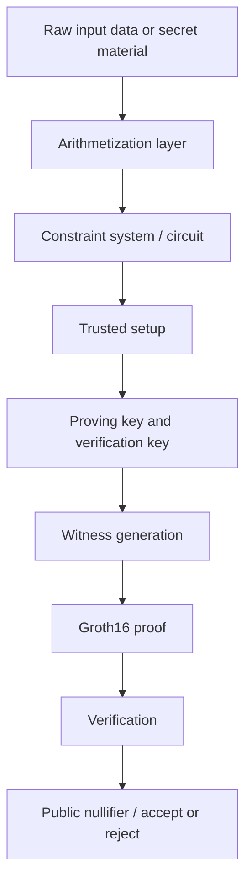
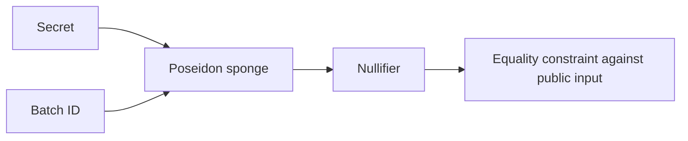

# Settlement ZK Prototype

> ⚠️ This README was made by AI.

A practical, research-oriented prototype for exploring zero-knowledge proofs in a settlement-style workflow. The repository demonstrates how a simple statement such as “a hidden secret corresponds to a public nullifier for a given batch” can be expressed as a constraint system, compiled into a zk-SNARK proof, and verified with Groth16 over the BLS12-381 pairing-friendly curve.

This project is intentionally scoped as a feasibility and methodology prototype rather than a production-ready settlement protocol. Its main purpose is to validate the end-to-end pipeline:

1. Arithmetize an idea into a finite-field relation.
2. Encode that relation as a circuit.
3. Generate a proof with a private witness.
4. Verify the proof using public inputs only.
5. Measure the cost of setup, proving, and verification as the batch size grows.

---

## 1. Executive summary

The repository contains a compact zk-proof prototype that models a simplified settlement rule:

- A prover possesses a private secret.
- A public batch identifier is supplied.
- A public nullifier is derived from the secret and batch identifier.
- The prover demonstrates knowledge of the secret without revealing it.

The core relation is:

$$
\text{nullifier} = \mathrm{Poseidon}(\text{secret}, \text{batch\_id})
$$

This is encoded as a constraint system and proven using Groth16. The project also includes a batched extension where many trades are checked in a single circuit.

---

## 2. What this project is trying to prove

At a high level, the system answers this question:

> Can a settlement-like statement be represented, proved, and verified using zk-SNARKs in a way that is understandable, measurable, and extensible?

The prototype is not intended to be a full settlement engine with on-chain settlement logic, liquidity management, or full cryptographic protocol compliance. Instead, it focuses on:

- proving knowledge of a hidden input,
- making public commitments (nullifiers) verifiable,
- benchmarking proving cost as circuit size increases,
- demonstrating a realistic constraint-based workflow with well-known primitives.

---

## 3. System architecture

### High-level data flow



### Circuit structure



### Batch circuit structure

```mermaid
flowchart TD
    subgraph Batch[Batch of N trades]
        T1[Trade 1: Poseidon(secret, batch_id)] --> N1[Nullifier 1]
        T2[Trade 2: Poseidon(secret, batch_id)] --> N2[Nullifier 2]
        T3[Trade 3: Poseidon(secret, batch_id)] --> N3[Nullifier 3]
        T4[Trade N: Poseidon(secret, batch_id)] --> N4[Nullifier N]
    end

    N1 --> C[Constraint system checks each relation]
    N2 --> C
    N3 --> C
    N4 --> C
```

---

## 4. Repository layout

```text
.
├── Cargo.toml
├── src/
│   ├── arithmetize.rs
│   ├── batch_circuit.rs
│   ├── benchmark.rs
│   ├── file_to_scalar.rs
│   ├── lib.rs
│   ├── main.rs
│   ├── nullifier_circuit.rs
│   └── poseidon_initializer.rs
├── benchmark_results.csv
├── benchmark_summary.csv
└── README.md
```

### Component roles

- [src/arithmetize.rs](src/arithmetize.rs): converts values into scalar field elements and provides bit decomposition helpers.
- [src/nullifier_circuit.rs](src/nullifier_circuit.rs): defines the single-trade nullifier proof circuit.
- [src/batch_circuit.rs](src/batch_circuit.rs): defines the batched version for many trades.
- [src/benchmark.rs](src/benchmark.rs): benchmarks setup, prove, verify, constraint count, and proof size.
- [src/main.rs](src/main.rs): a full demonstration of building the proof and verifying it end to end.
- [src/poseidon_initializer.rs](src/poseidon_initializer.rs): prepares Poseidon parameters for the circuit.
- [src/file_to_scalar.rs](src/file_to_scalar.rs): creates a sample data file and converts it into a scalar witness.

---

## 5. Design methodology

### 5.1 Arithmetization strategy

Arithmetization is the process of turning an application-level statement into a relation over a finite field. In this project, values are represented as elements of the scalar field of the BLS12-381 curve.

The repository supports three common patterns:

1. Small integers
   - A compact integer such as a batch identifier or a small counter is mapped directly into the field.
   - This is simple and inexpensive.

2. Arbitrary bytes or files
   - A byte string is hashed using SHA-512 and then reduced modulo the scalar field order.
   - This creates a deterministic field element for use as a witness or commitment input.

3. Bit decomposition
   - For values that need to be reasoned about bitwise inside the circuit, the field element is decomposed into bits.
   - This enables range-style reasoning inside the arithmetic constraints.

In this prototype, the main witness is a scalar derived from file bytes, while the public statement is built from the batch identifier and the resulting nullifier.

### 5.2 Constraint-based modeling

A constraint system is a set of algebraic equations that must be satisfied for a proof to be accepted. The nullifier circuit enforces:

$$
\text{Poseidon}(\text{secret}, \text{batch\_id}) = \text{nullifier}
$$

This is encoded as a circuit relation where:

- the secret is a private witness,
- the batch identifier and nullifier are public inputs,
- the circuit checks the committed relation directly.

The circuit is intentionally simple so that the proof machinery is easier to inspect and reason about.

### 5.3 Why Poseidon?

Poseidon is used because it is well suited to zero-knowledge circuits:

- it is arithmetic-friendly,
- it has strong security properties,
- it maps naturally into constraint systems,
- it is a practical choice for hash-like relations inside zk proofs.

The implementation uses a Poseidon sponge construction with absorb and squeeze operations, which is a natural fit for this “hash secret and batch identifier into a nullifier” use case.

### 5.4 Why Groth16?

Groth16 is used because it is a mature, well-understood zk-SNARK construction with straightforward tooling and established Rust support through Arkworks.

Benefits of the choice in this prototype:

- stable API and good documentation,
- easy end-to-end demonstration,
- fast iteration for feasibility testing,
- straightforward proof verification logic.

Tradeoffs:

- Groth16 requires a trusted setup per circuit shape,
- it is not recursive or folding-based,
- it is not the only candidate for a more advanced settlement architecture.

This project explicitly frames Groth16 as a baseline proof system rather than the final answer for a broader settlement design.

---

## 6. Design parameters and implementation choices

| Parameter | Choice | Reason |
|---|---|---|
| Curve | BLS12-381 | Well-supported pairing curve with strong ecosystem support |
| Proof system | Groth16 | Mature, concise, and practical for prototyping |
| Hash primitive | Poseidon | Circuit-friendly and suitable for zk constraints |
| Scalar field | BLS12-381 scalar field | Provides the arithmetic domain for the circuit |
| Private input | Secret | Kept off-chain and hidden from the verifier |
| Public inputs | Batch ID, Nullifier | Used in verification and commitment checks |
| Witness encoding | Scalar field element | Simplifies arithmetic representation |
| Arithmetization of bytes | SHA-512 -> field element | Deterministic and efficient hashing into field |
| Batch benchmark sizes | 1, 2, 4, 8, 16, 32 | Small enough to run on a laptop while showing scaling |
| Benchmark repetitions | 5 | Gives a basic average and variance estimate |

### Notes on parameter selection

The design favors clarity and repeatability over extreme scale. The batch sizes are deliberately modest because the goal is to validate methodology on a laptop rather than to benchmark a production-grade deployment.

---

## 7. Proof workflow

The repository implements the following lifecycle:

1. Create a circuit.
2. Generate a setup with the circuit shape.
3. Build a witness using the private secret and public inputs.
4. Prove the circuit statement.
5. Verify the proof with only the public inputs.

This sequence is demonstrated in [src/main.rs](src/main.rs) and reused conceptually by the benchmark driver in [src/benchmark.rs](src/benchmark.rs).

### The proof model in words

- The prover knows a secret.
- The prover claims a public nullifier derived from that secret and a batch identifier.
- The circuit checks the relation.
- If the secret does not match the nullifier, the proof fails.

This is the core of the prototype’s “knowledge-of-secret” property.

---

## 8. Benchmarking methodology

The benchmark script measures the following metrics for each batch size:

- setup time,
- prove time,
- verify time,
- number of constraints,
- proof size in bytes.

The benchmark is implemented in [src/benchmark.rs](src/benchmark.rs) and writes results to [benchmark_results.csv](benchmark_results.csv).

### Benchmarking assumptions

- Each batch size is tested across multiple repetitions.
- Setup is performed once per batch size and reused across repeated proofs.
- The circuit shape is fixed for a given batch size.
- Proving cost is expected to scale roughly with the number of constraints.

### Why this matters

The benchmark helps validate that the implementation is behaving in a predictable way:

- more constraints should generally lead to more proof work,
- proof generation should grow as the circuit becomes larger,
- verification should remain practical for the measured sizes.

This provides a sanity check before attempting more ambitious protocol designs.

---

## 9. Running the project

### Prerequisites

Install Rust and Cargo:

```bash
cargo --version
rustc --version
```

### Build the project

```bash
cargo build
```

### Run the end-to-end proof demo

```bash
cargo run --bin settlement_zk_prototype
```

The main example builds a small proof and verifies it.

### Run the benchmark suite

```bash
cargo run --release --bin benchmark
```

This generates [benchmark_results.csv](benchmark_results.csv) and prints per-batch metrics to the terminal.

---

## 10. Testing

The project includes unit tests for the arithmetization logic and circuit constraints.

Run tests with:

```bash
cargo test
```

The tests verify that:

- scalar conversion works as expected,
- byte-to-scalar hashing is deterministic,
- bit decomposition reconstructs values correctly,
- honest witnesses satisfy the circuit constraints,
- tampered witnesses fail when the relation is broken.

---

## 11. Security and design caveats

This repository is a prototype, and several important production concerns are intentionally omitted:

- no full settlement-state model,
- no on-chain integration,
- no formal security proof for the broader system,
- no production-grade key-management lifecycle,
- no adversarial analysis against real-world threat models.

The prototype should therefore be understood as a demonstration of technique and methodology, not as a deployed cryptographic settlement system.

---

## 12. Future directions

A natural next step would be to extend this prototype into a more complete comparison framework:

- port the same circuit to alternative zk systems,
- compare Groth16, PLONK-style systems, and recursive/folding-based systems,
- analyze proof size, setup cost, prover cost, and verifier cost under the same workload,
- integrate a realistic settlement or double-spend model,
- connect proof generation to a real transaction or settlement pipeline.

That would turn this local prototype into a more rigorous benchmark and design study.

---

## 13. Summary

This repository demonstrates a compact but meaningful zero-knowledge proof workflow:

- it turns a settlement-like statement into a constraint system,
- it uses Poseidon and Groth16 to prove knowledge of a hidden input,
- it shows how public nullifiers can be checked without revealing the secret,
- it gives a repeatable benchmark harness for measuring proof performance.

The code is simple enough to understand, but the concepts are representative of the core challenges in modern zk-based systems.
